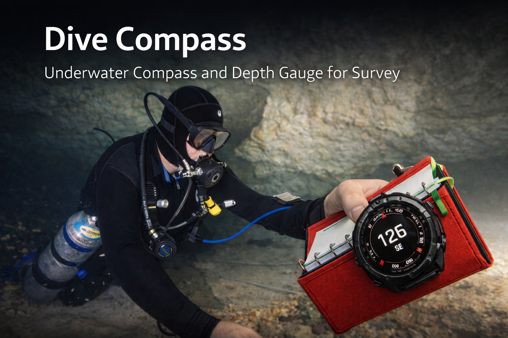
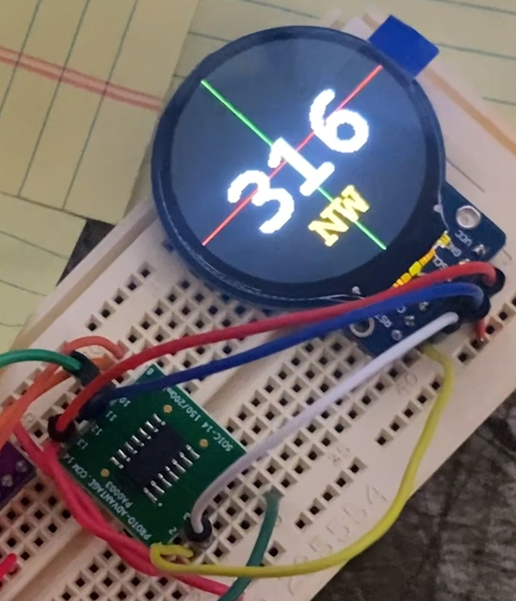

  

    
    
    
    
     
    
    
    
    
     
    
    
    
    

---

# Project Overview

Underwater Cave Exploration - finding new places nobody has ever been, underwater, while cave diving - is an amazing feeling.  However, the cave diving community frowns on people who just go find stuff and don't make a record of the new passage.  Part of the reason this happens is because documenting new passage underwater is very challenging.

Typically, a lead diver will lay a guideline through the cave and into a new section, tying off the line to "stations" like rocks on the floor or protrusions on the wall, keeping care that the lines are straight and do not slowly bend around walls.  A second diver will then follow behind, stopping at each station (tie-off) and take some measurements, recorded in a notebook with waterproof paper and a pencil.

These measurements include:

* Distance from the previous station.
* Azimuth (Compass Bearing)
* Depth of Water
* LRUDs (distance from the station to the walls - in the directions Left, Right, Up, Down)

Given this information, a 3-dimensional map can be created, and eventually a map others can use to navigate through the underwater passages.  Here is an example of an underwater cave map:

While a normal compass with headings marked on it can be used, it can prove problematic in low-light and potentially "not perfectly horizontal" positions.  Additionally, sometimes the numbers on compasses are very small and can be difficult to see while aligning with the guideline.  It is highly desirable to use a digital compass for headings - align the compass with the guideline, read a number, simple.

Unfortunately, very few off-the-shelf answers exist.  Until recently, the SeaBear dive computer was great - small (wristwatch sized) and bright and the screen could lock onto the compass view.  This computer went out of production a number of years ago and supplies are quickly dwindling.  Also, deep cave diving and exploratory cave diving is a difficult environment - computers die.

Both Shearwater and Garmin make dive watches that are small enough to use for this purpose - but these are expensive - over $1K.  Also, these are generally designed to be used for diving, so having them not firmly attached to your body can be problematic - if you lose the dive book with the compass/dive computer, you lose your source of decompression data.  Not ideal.

The goal of this project is to build a small, waterproof, affordable, dedicated dive computer/depth gauge that can be calibrated and mounted in a survey book.

# Architecture

## A note on "electronic compasses"

Practically speaking, at the scales discussed here, there is no such thing as a "digital compass."  Most digital devices with compasses built in are really "magnetometers" that are detecting the earth's magnetic field.  In a perfect world, this is a "mostly spherical" but requires calibration to find local lows/highs in the X/Y/Z directions.  [This article](https://docs.nanoframework.net/devicesdetails/Ak8963/README.html) does a great job of describing a simliar unit.

Calibration can be tricky - any nearby ferromagnetic items (cars, electrical lines, underground metal pipes, rebar in a building) can interfere with magnetic fields.  Additionally, if the magnetometer is exposed to a high enough magnetic field, it can fall out of calibration.  These really are sensitive devices.

## A note on IMUs (Intertial Measurement Units)

It's not quite enough to know what the magnetic fields are doing around the device - it's also important to be able to hold the device level.  As such, a multi-sensor IMU needs to be used.  These contain a magnetometer, accelerometer, and gyroscope.  The aim of this unit is to be able to indicate "is the compass level" - since compass headings are most accurate when precisely level.

## Devices
* [AVR128DA32](https://ww1.microchip.com/downloads/en/DeviceDoc/40002183A.pdf)
  * [Pinout](https://cdn.tindiemedia.com/images/resize/2fxPFlhMai_0tOqyeikwEtcKKMA=/p/fit-in/1370x912/filters:fill(fff)/i/77443/products/2023-04-18T07%3A53%3A42.799Z-DA32.png?1681779270)
* [GC9A01](https://www.makerfabs.com/desfile/files/GC9A01A.pdf) Round Display
  * SPI interface
  * May want to look for a module with backlight controls?
  * [Amazon Link](https://www.amazon.com/gp/product/B0C1G92F2B) $6
* [LIS3MDL](https://www.st.com/resource/en/datasheet/lis3mdl.pdf)
  * Magnetometer
  * Not used - very noisy and inaccurate
  * [Amazon Link](https://www.amazon.com/gp/product/B071VS6GJM)
* [MPU6050](https://invensense.tdk.com/wp-content/uploads/2015/02/MPU-6000-Datasheet1.pdf)
  * Accelerometer/Gyro
  * Not used - drift makes this unusable
  * [Amazon Link](https://www.amazon.com/gp/product/B01DK83ZYQ)
* [QMC5883L](https://www.lcsc.com/datasheet/lcsc_datasheet_2410121532_QST-QMC5883L_C976032.pdf)
  * 3-Axis Magnetic Sensor
  * Library provides good smoothing and seems to sit at +/- 0.5 degrees
  * Calibration is easy
  * [Amazon Link](https://www.amazon.com/gp/product/B008V9S64E) $7
* [BNO080](https://cdn.sparkfun.com/assets/1/3/4/5/9/BNO080_Datasheet_v1.3.pdf)
  * 9-axis sensor module
  * Accelerometer/Gyroscope/Magnetometer
  * [Amazon Link](https://www.amazon.com/gp/product/B0CDGZMLPP) $19
  

## AVR128DA32 Pin Connections

| Physical Pin | Virtual Pin | Port | Function | Name | Connected To |
| :---: | :---: | :---: | :---: | :---: | :--- |
| 1 | 3 | PA3 | TWI0 | SCL0 | Device I2C SCL |
| 2 | 4 | PA4 | SPI0 | MOSI0 | Display SDA |
| 3 | 5 | PA5 | SPI0 | MISO | n/c (display does not output data) |
| 4 | 6 | PA6 | SPI0 | SCK0 | Display SCL |
| 5 | 7 | PA7 | SPI0 | SS0 | Display CS |
| 6 | 8 | PC0 | GPIO | | Display DC (data/command) |
| 7 | 9 | PC1 | GPIO | | Display RST | 
| 8 | 10 | PC2 | | | 
| 9 | 11 | PC3 | | | 
| 10 | 12 | PD0 | GPIO | | BNO080 Ext INT #1 |
| 11 | 13 | PD1 | GPIO | | BNO080 Ext INT #2 |
| 12 | 14 | PD2 | GPIO | | BNO080 RST #1 BNO080 RST #2 |
| 13 | 15 | PD3 | | | 
| 14 | 16 | PD4 | | | 
| 15 | 17 | PD5 | | | 
| 16 | 18 | PD6 | | | 
| 17 | 19 | PD7 | | | 
| 18 | | AVCC | AVCC | +3.3V | 
| 19 | | GND | GND | GND | 
| 20 | 20 | PF0 | | | 
| 21 | 21 | PF1 | | | 
| 22 | 22 | PF2 | | | 
| 23 | 23 | PF3 | | | 
| 24 | 24 | PF4 | | | 
| 25 | 25 | PF5 | | | 
| 26 | 26 | PF6 | RST | Reset Switch | N/O momentary switch with 10K | 
| 27 | | UPDI | UPDI | Programmer UPDI |
| 28 | | VCC | VCC | +3.3V | 
| 29 | | GND | GND | GND | 
| 30 | 0 | PA0 | Serial0 | TXD0 | 220 ohm --> RS232 RXD |
| 31 | 1 | PA1 | Serial0 | RXD0 | 220 ohm --> RS232 TXD |
| 32 | 2 | PA2 | TWI0 | SDA0 | Device I2C SDA |

## Additional Notes

* Finding Serial Ports with PowerShell
  * DETAILS: [System.IO.Ports.SerialPort]::GetPortNames()
  * SUMMARY LIST: Get-WMIObject Win32_SerialPort

## Testing

    

